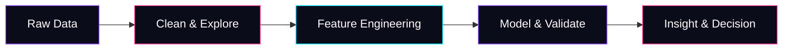

<div align="center">


<br>


</div>

<br>


## 👋 &nbsp;Hello, I'm Emmanuel Rajj

```python
class EmmanuelRajj:
    role     = "Aspiring Data Scientist"
    focus    = ["Predictive Modeling", "Machine Learning", "Deep Learning"]
    toolkit  = ["Python", "SQL", "Pandas", "Scikit-learn", "TensorFlow"]
    mission  = "Turn raw data into decisions people can act on"
    status   = "Actively seeking a Data Science / ML internship"

    def say_hi(self):
        return "manikarraj@gmail.com"
```


## 🧰 &nbsp;Tech Stack

<div align="center">


</div>

<br>

<div align="center">


</div>

---

## 🚀 &nbsp;Featured Projects

<table>
<tr>
<td width="33%" valign="top">

### ☕ Cafe Data Lab
Revenue prediction model for a cafe business using historical sales data.

`Pandas` `Regression` `EDA`

</td>
<td width="33%" valign="top">

### 🛒 E-commerce CLV
Predicting Customer Lifetime Value to drive retention strategy.

`Feature Engineering` `Machine Learning`

</td>
<td width="33%" valign="top">

### ⚽ Messi Tactical Analytics
Tactical performance analysis using match data and visualization.

`Seaborn` `Matplotlib` `Data Viz`

</td>
</tr>
</table>

---

## 🔄 &nbsp;How I Work



---

## 📊 &nbsp;GitHub Stats

<div align="center">


<br>


</div>

---

## 🤝 &nbsp;Let's Connect

<div align="center">

<a href="mailto:manikarraj@gmail.com">
  
</a>
<a href="https://github.com/manikarraj-cmd">
  
</a>

<br><br>

<i>Open to Data Science / Machine Learning internship opportunities — let's build something.</i>

</div>

<br>

<div align="center">

<!--START_SECTION:snake-->

<!--END_SECTION:snake-->

</div>


